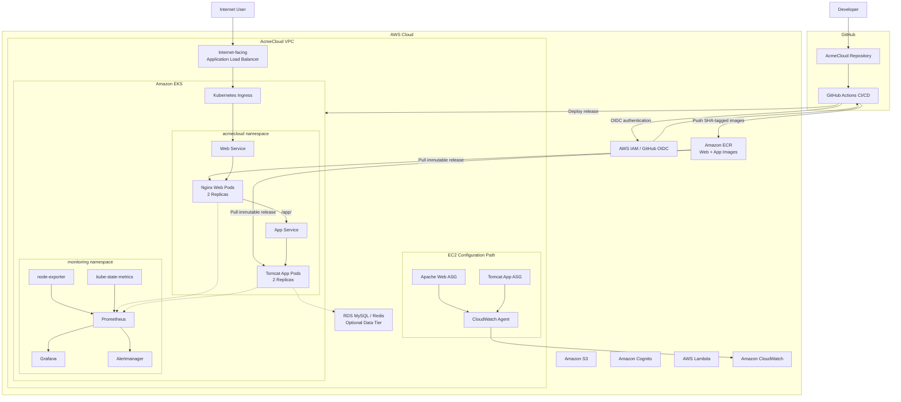

# AcmeCloud Enterprise Platform — Production Architecture

## Overview

AcmeCloud Enterprise Platform is a production-style DevOps platform built on AWS to demonstrate infrastructure provisioning, configuration management, containerization, Kubernetes orchestration, observability, CI/CD, security, resilience, and operational cost control.

The platform combines:

- Terraform for AWS Infrastructure as Code
- Ansible for EC2 configuration management
- Docker for application containerization
- Amazon ECR for private container image storage
- Amazon EKS for Kubernetes orchestration
- AWS Load Balancer Controller for Kubernetes ingress
- Prometheus, Grafana, and Alertmanager for Kubernetes observability
- Amazon CloudWatch for EC2 infrastructure monitoring
- GitHub Actions for CI/CD
- GitHub OIDC and AWS IAM for keyless CI/CD authentication

## Final Architecture



## Application Request Flow

The validated Kubernetes request path is:

```text
Internet
   |
   v
AWS Application Load Balancer
   |
   v
Kubernetes Ingress
   |
   v
acmecloud-web Service
   |
   v
Nginx Web Pods
   |
   | /app/
   v
acmecloud-app Service
   |
   v
Tomcat Application Pods
```

The AWS Load Balancer Controller provisions and manages the internet-facing Application Load Balancer from the Kubernetes Ingress resource.

The ALB uses IP target mode and routes directly to the web pod IP addresses.

The final production validation confirmed:

- `/` returned HTTP 200
- `/app/` returned HTTP 200
- Both ALB web targets were healthy
- Two web replicas were available
- Two application replicas were available
- Workloads were distributed across both EKS worker nodes
- Application and web pods completed the final rollout with zero restarts

## Infrastructure Architecture

Terraform is responsible for provisioning and controlling the AWS infrastructure.

The infrastructure is divided into reusable modules for:

- VPC networking
- Security groups
- EC2 compute
- Load balancing
- RDS and Redis
- Storage and identity
- Amazon EKS
- IAM and GitHub OIDC integration

The VPC contains public, private application, and private database subnets distributed across multiple Availability Zones.

Production-cost resources such as the NAT Gateway, EKS cluster, Application Load Balancer, and optional data tier can be disabled when the lab is not in use.

## Configuration Management

Ansible manages the EC2 configuration layer.

The platform uses reusable roles for:

- Common operating-system configuration
- SSH security hardening
- Apache
- Java and Apache Tomcat
- Amazon CloudWatch Agent

AWS dynamic inventory discovers the required EC2 instances.

The roles are designed to be idempotent so configuration can be reapplied without introducing unnecessary changes.

## Container Architecture

The application contains two container images:

### Web Tier

The web image uses Nginx and:

- Serves the AcmeCloud web interface
- Proxies `/app/` traffic to the application service
- Runs as numeric non-root UID/GID `101:101`

### Application Tier

The application image uses Apache Tomcat and:

- Runs the AcmeCloud application
- Listens on port 8080
- Runs as numeric non-root UID/GID `1000:1000`

Container security controls include:

- Non-root execution
- `allowPrivilegeEscalation: false`
- Linux capabilities dropped
- `RuntimeDefault` seccomp profile

## Immutable Release Architecture

Production releases use the first 12 characters of the Git commit SHA as the container image tag.

Example validated release:

```text
536b0e8455a0
```

Both application images for a release use the same immutable identifier:

```text
acmecloud-app:536b0e8455a0
acmecloud-web:536b0e8455a0
```

This provides traceability from:

```text
Git Commit
    |
    v
GitHub Actions
    |
    v
Docker Images
    |
    v
Amazon ECR
    |
    v
Kubernetes Release
```

Kustomize injects the selected immutable release tag into the Kubernetes manifests before deployment.

The base deployment manifests intentionally contain `RELEASE_TAG` rather than a deployable version tag, preventing an old image version from being silently redeployed.

## CI/CD Architecture

GitHub Actions performs:

1. Repository validation
2. Docker build validation
3. Kubernetes manifest validation
4. Trivy container security scanning
5. AWS authentication using GitHub OIDC
6. Container image publishing to Amazon ECR
7. Production release rendering
8. Amazon EKS deployment
9. Kubernetes rollout verification
10. Deterministic rollback when rollout verification fails

No long-lived AWS access keys are stored in GitHub for the deployment workflow.

GitHub Actions assumes the dedicated AWS IAM role:

```text
acmecloud-production-github-actions
```

Application deployment authorization is scoped to the `acmecloud` namespace.

Infrastructure administration remains separate from application deployment permissions.

## Observability Architecture

The EKS environment uses kube-prometheus-stack.

The monitoring namespace contains:

- Prometheus
- Grafana
- Alertmanager
- kube-state-metrics
- node-exporter

The metrics path is:

```text
EKS Nodes -----------+
Kubernetes Objects --+--> Prometheus --> Grafana
Application State ---+         |
                               v
                          Alertmanager
```

Custom AcmeCloud alerting rules monitor:

- Node availability
- High node CPU utilization
- High node memory utilization
- Container restarts
- Deployment replica availability
- Pods remaining not ready

Grafana uses Prometheus as its default metrics data source.

Monitoring administrative access remains private through a ClusterIP service and local Kubernetes port forwarding rather than provisioning another public load balancer.

## Resilience and Rollback

The Kubernetes deployments use rolling-update behavior designed to retain healthy application capacity while replacement pods are created.

The platform was tested with deliberately invalid container image references.

During the failure test:

- Existing healthy replicas remained available
- Replacement pods failed with `ErrImagePull`
- The failed rollout was detected
- Both deployments were restored to their previous known-good images

The CI/CD workflow records the currently deployed application and web images before a production deployment.

If rollout verification fails, the workflow can restore those exact previous image references rather than relying on a mutable tag.

## Security Architecture

Security controls are applied across multiple layers.

### AWS

- Dedicated security groups between application tiers
- Private application subnets
- Private database subnets
- IAM roles instead of embedded AWS credentials
- GitHub OIDC instead of static CI/CD AWS access keys
- Namespace-scoped EKS deployment authorization
- S3 public-access blocking
- S3 server-side encryption

### EC2

- Root SSH login disabled
- SSH password authentication disabled
- SSH idle timeout configured
- Systems Manager integration
- CloudWatch Agent monitoring

### Containers and Kubernetes

- Non-root containers
- Numeric container users
- Privilege escalation disabled
- Linux capabilities dropped
- RuntimeDefault seccomp profile
- Private ECR repositories
- Immutable SHA-tagged production releases

## Cost-Control Architecture

The platform is designed as a portfolio lab and therefore includes explicit lifecycle controls for expensive AWS resources.

The repository provides:

```text
scripts/aws-lab-restore.sh
scripts/aws-lab-shutdown.sh
```

The restore process requires an explicit immutable `RELEASE_TAG`.

Before restoring chargeable infrastructure, the script verifies that the selected release exists in both ECR repositories.

The shutdown process disables/removes chargeable lab components including:

- Amazon EKS
- EKS worker nodes
- Kubernetes-created Application Load Balancer
- NAT Gateway
- NAT Elastic IP
- Optional data-tier resources

Baseline infrastructure can remain available while expensive runtime resources are disabled.

## Final Production Validation

The final integrated release validated was:

```text
536b0e8455a0
```

The end-to-end validation confirmed:

- Both immutable images existed in Amazon ECR
- Application deployment: 2/2 replicas available
- Web deployment: 2/2 replicas available
- Workloads distributed across both EKS worker nodes
- Zero application workload restarts
- Internet-facing ALB successfully provisioned
- `/` returned HTTP 200
- `/app/` returned HTTP 200
- Both current ALB targets reported healthy
- Prometheus was operational
- Grafana was operational
- Alertmanager was operational
- Custom AcmeCloud Prometheus alert rules were loaded
- Monitoring components were healthy
- NAT Gateway, EKS, ALB, and NAT Elastic IP were successfully removed after validation to control AWS cost

## Operational Lifecycle

The complete platform lifecycle is:

```text
Restore Infrastructure
        |
        v
Verify Immutable Release
        |
        v
Restore EKS
        |
        v
Deploy Application
        |
        v
Create ALB Ingress
        |
        v
Restore Monitoring
        |
        v
Validate Production
        |
        v
Operate / Test
        |
        v
Shutdown Chargeable Resources
```

This lifecycle allows the complete production-style platform to be demonstrated when required while keeping ongoing AWS lab costs controlled.
