# AcmeCloud Project Evidence

This directory contains reproducible technical evidence from the AcmeCloud Enterprise Platform implementation and final validation.

The screenshots complement the source code, Git history, architecture documentation, and infrastructure definitions in the repository.

## Terraform

### Configuration Validation

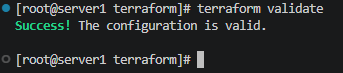

Terraform configuration successfully passes `terraform validate`.

### Terraform Modules

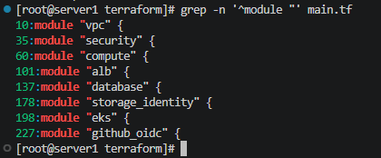

The infrastructure is separated into reusable modules for networking, security, compute, load balancing, data services, storage and identity, EKS, and GitHub OIDC.

## Ansible

### Playbook Syntax Validation

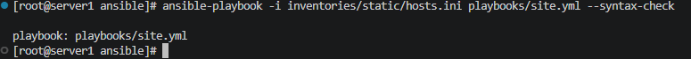

The main Ansible configuration playbook successfully passes syntax validation.

### AWS Dynamic Inventory

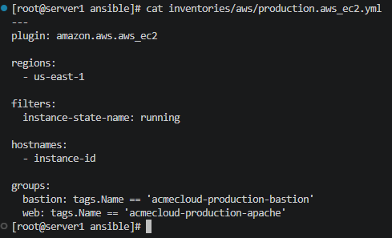

Amazon EC2 instances are dynamically grouped into bastion, web, and application tiers.

## Docker and Amazon ECR

### Immutable Production Release

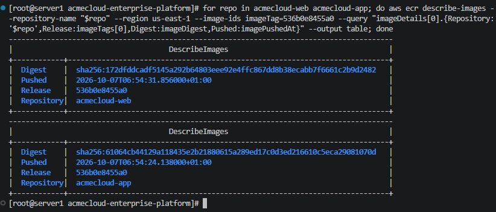

The final integrated web and application images use the same immutable Git-SHA-derived release identifier.

### ECR Security Configuration

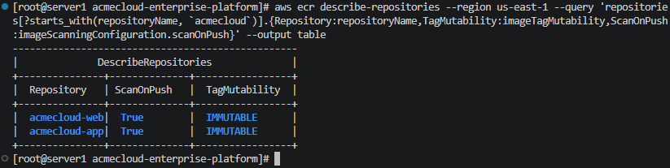

The private ECR repositories use immutable image tags and image scanning on push.

## Kubernetes and Amazon EKS

### Kustomize Validation

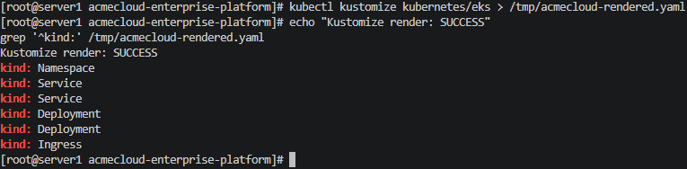

Kustomize successfully renders the namespace, services, deployments, and ingress resources.

### Workload Security Hardening

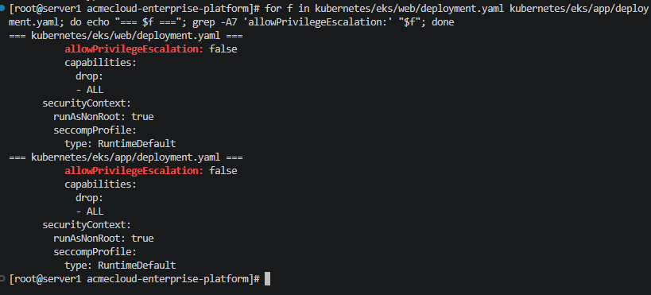

Web and application workloads disable privilege escalation, drop Linux capabilities, require non-root execution, and use the RuntimeDefault seccomp profile.

## GitHub Actions CI/CD

### AWS OIDC Authentication

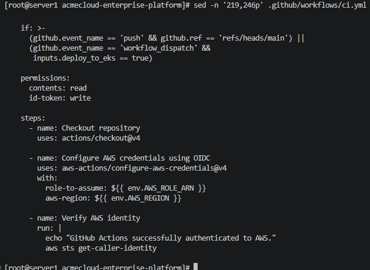

GitHub Actions uses OIDC federation to assume the deployment IAM role without storing long-lived AWS credentials.

### EKS Deployment Verification

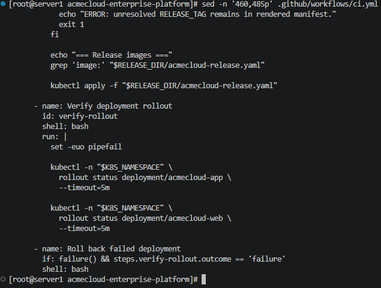

The deployment workflow renders the immutable release, applies the Kubernetes resources, and verifies application and web rollouts.

### Automatic Rollback

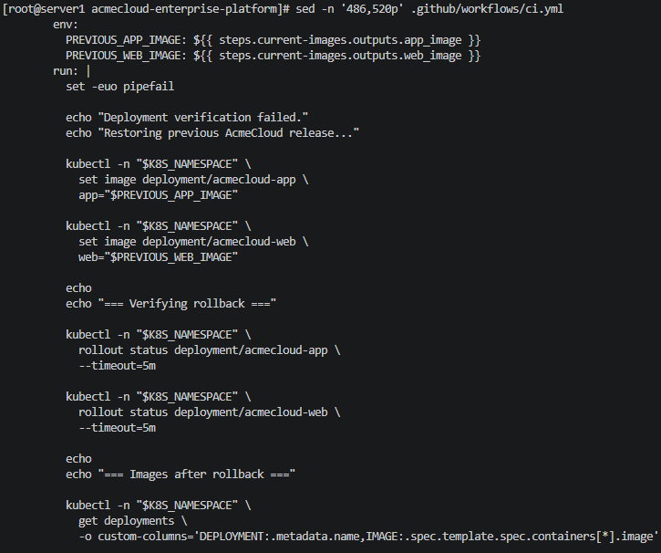

The CI/CD workflow preserves the previously running images and restores them when rollout verification fails.

## Monitoring

### Prometheus Alert Rules

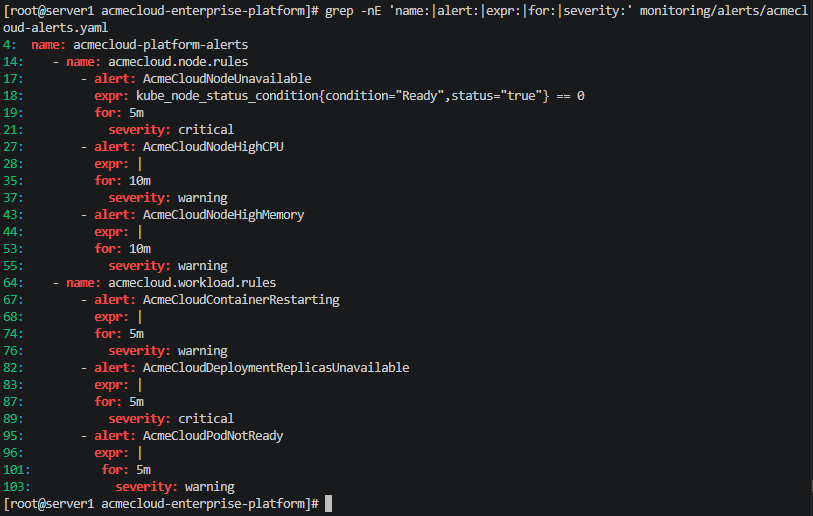

Custom alert rules cover node availability, CPU, memory, container restarts, deployment availability, and pod readiness.

### Grafana Dashboard

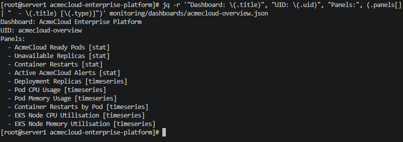

The AcmeCloud Grafana dashboard includes workload, restart, CPU, memory, node, and alert visibility.

## Cost-Control Validation

### AWS Runtime Resource Audit

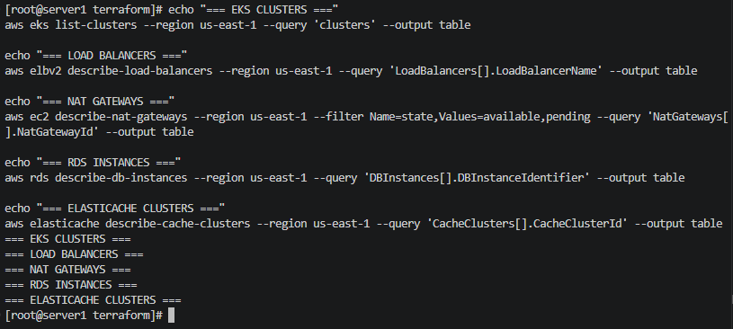

The post-demonstration AWS audit confirms that chargeable EKS, load balancer, NAT Gateway, RDS, and ElastiCache runtime resources were removed.

### Terraform Cost-Control Flags

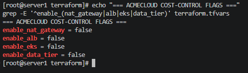

Terraform feature flags keep optional chargeable runtime components disabled between demonstrations.

---

These screenshots represent configuration, validation, and current reproducible project evidence. Historical implementation claims are additionally supported by the repository source code, Git history, and project documentation.
