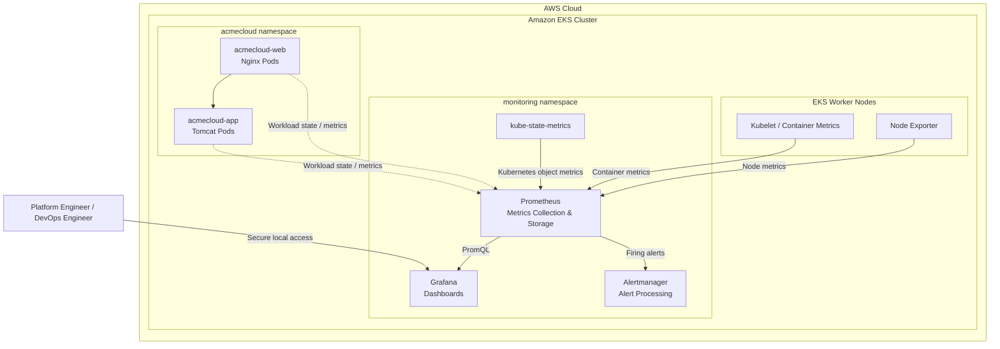

# AcmeCloud Monitoring Architecture

The AcmeCloud Enterprise Platform uses the Prometheus monitoring
ecosystem to provide observability for the Amazon EKS infrastructure,
Kubernetes resources, and AcmeCloud application workloads.

## Architecture

## Metrics Flow

The monitoring pipeline follows this flow:

1. **node-exporter** exposes worker-node operating-system metrics.
2. **kubelet/container metrics** provide container resource utilization.
3. **kube-state-metrics** exposes Kubernetes object-state metrics.
4. **Prometheus** discovers and scrapes monitoring targets.
5. Prometheus stores collected time-series metrics and evaluates alerting rules.
6. **Grafana** queries Prometheus using PromQL and presents dashboards.
7. **Alertmanager** processes alerts generated by Prometheus rules.

## Monitoring Scope

The monitoring platform provides visibility across three primary layers:

### Infrastructure

- EKS worker-node availability
- CPU utilization
- Memory utilization
- Filesystem utilization
- Network activity

### Kubernetes

- Pod health
- Container restarts
- Deployment replicas
- Container CPU and memory utilization
- Kubernetes resource state

### AcmeCloud Applications

- acmecloud-web availability
- acmecloud-app availability
- Workload CPU and memory consumption
- Pod and container health

## Access Design

Grafana is initially exposed using a Kubernetes `ClusterIP` service.

This avoids creating an additional public AWS load balancer solely for
monitoring. Administrative access during the lab will use secure local
access such as Kubernetes port forwarding.

## Storage Design

The initial lab deployment uses ephemeral monitoring storage.

Persistent storage will be evaluated later as a production-hardening
improvement after the monitoring stack has been validated.
